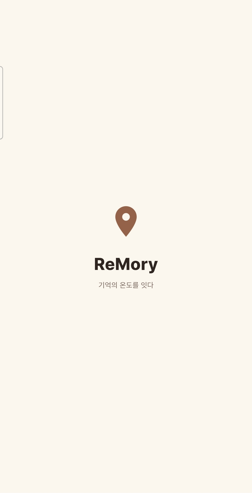
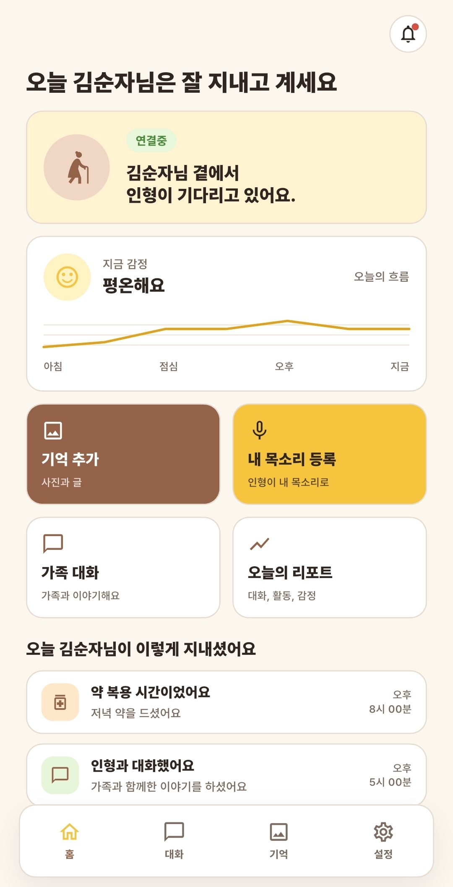
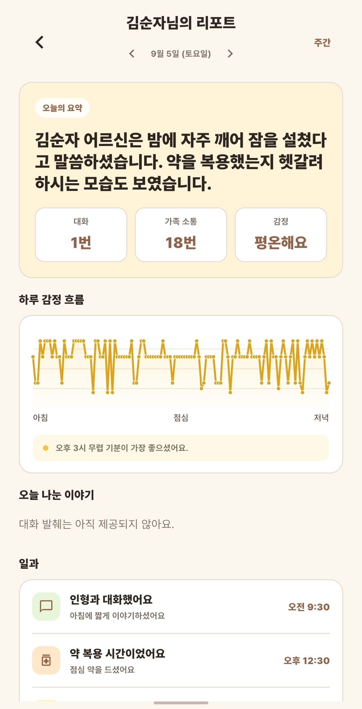
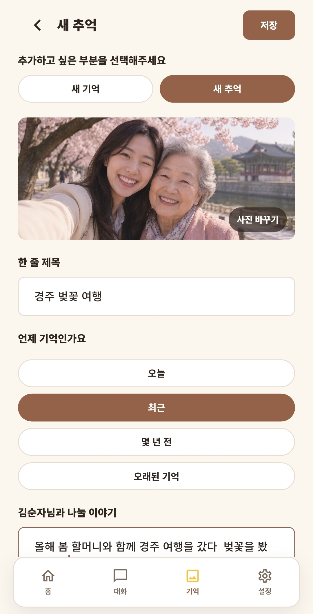
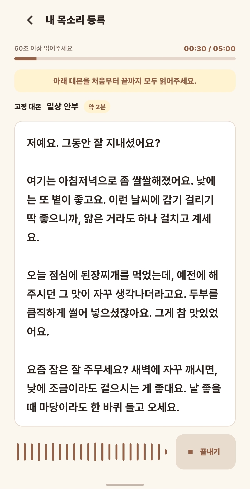
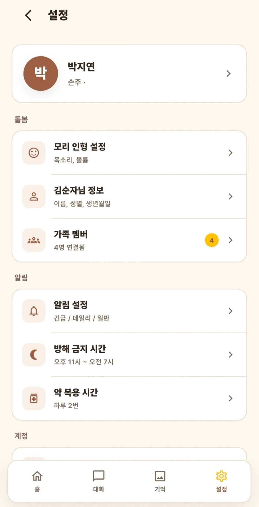
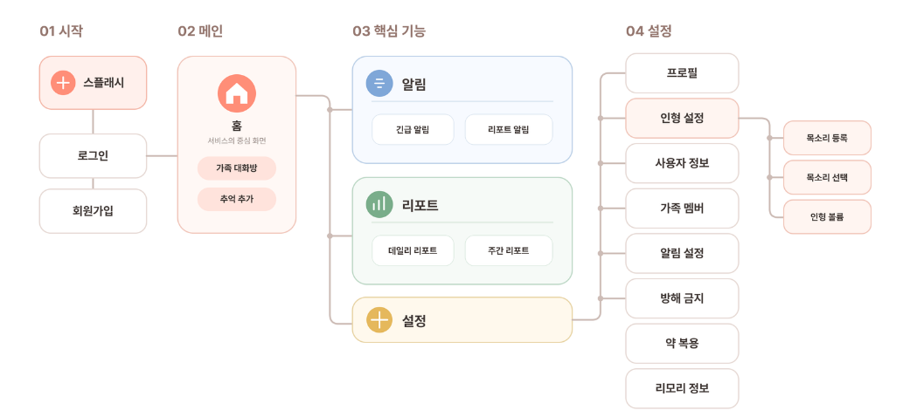
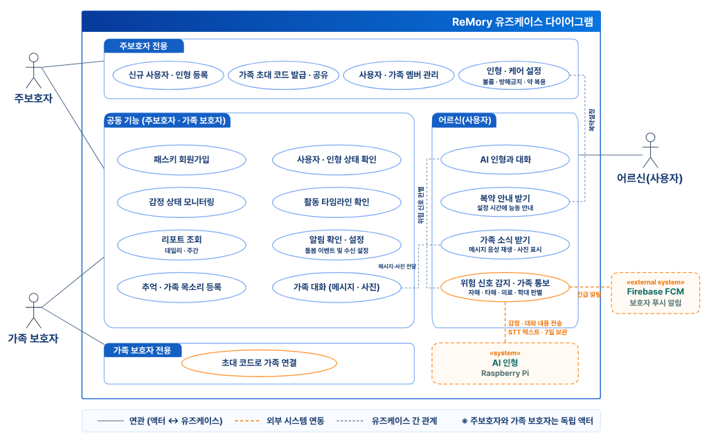
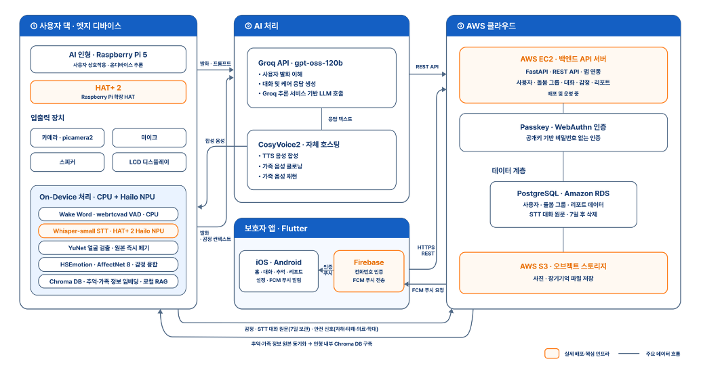

<div align="center">

# 🧸 ReMory Frontend

**치매 어르신과 가족을 잇는 돌봄 인형 서비스, 리모리(ReMory)의 보호자 앱**

인형 *모리*는 어르신 곁에서 말벗이 되고,<br/>
가족은 앱으로 안부를 살피고 마음을 전합니다.

<br/>


[프론트엔드 저장소](https://github.com/Hanium-Remory/flutter)

</div>

---

## 📖 이런 서비스입니다

어르신과 떨어져 지내는 가족은 일상의 안부를 수시로 살피기 어렵습니다.

**리모리는 어르신 곁에 인형을 둡니다.** 인형 *모리* 는 어르신과 대화를 나누고,
가족이 남긴 메시지를 **가족의 목소리로** 읽어주고, 약 드실 시간을 알려줍니다.
그 사이에 쌓인 대화·감정·활동은 가족 앱의 홈 화면과 하루 리포트로 정리되어 전달됩니다.

<table>
<tr>
<td width="33%" valign="top">

### 👵 어르신
말벗이 되어주는 인형 **모리**.
"모리야" 하고 부르면 대답하고,
사진 속 추억을 함께 이야기하고,
약 시간을 챙겨줍니다.

</td>
<td width="33%" valign="top">

### 🧸 인형 (Device)
Raspberry Pi 5 + 카메라·마이크·스피커.
대화·감정·활동을 서버에 올리고,
가족 메시지와 어르신 정보(RAG)를
서버에서 받아 갑니다.

</td>
<td width="33%" valign="top">

### 👨‍👩‍👧 가족 (보호자)
Flutter 앱으로 어르신 상태를 보고,
대화방에 메시지·사진을 남기고,
자기 목소리를 등록하고,
오늘의 리포트를 받습니다.

</td>
</tr>
</table>

---

## 📱 앱 화면 미리보기

<table>
<tr>
<th align="center" width="33%">온보딩 화면</th>
<th align="center" width="33%">홈 화면</th>
<th align="center" width="33%">오늘의 리포트</th>
</tr>
<tr>
<td align="center" valign="top"></td>
<td align="center" valign="top"></td>
<td align="center" valign="top"></td>
</tr>
<tr>
<th align="center" width="33%">추억 추가</th>
<th align="center" width="33%">목소리 등록</th>
<th align="center" width="33%">설정</th>
</tr>
<tr>
<td align="center" valign="top"></td>
<td align="center" valign="top"></td>
<td align="center" valign="top"></td>
</tr>
</table>

---

## ✨ 주요 화면과 기능

| 화면 | 보호자가 할 수 있는 일 |
|---|---|
| 👋 **온보딩** | 서비스 소개를 보고 가입·로그인을 시작합니다 |
| 🔐 **가입·로그인** | Firebase 전화번호 인증과 패스키로 계정을 등록하고 로그인합니다 |
| 👨‍👩‍👧 **최초 등록·가족 연결** | 보호자·어르신 정보를 입력하고 초대 코드로 가족을 연결합니다 |
| 🏠 **홈 대시보드** | 서버에서 인형 상태·감정·활동을 불러와 주기적으로 갱신합니다 |
| 🔔 **알림 센터** | 서버 알림을 확인하고 읽음 처리하며, FCM 푸시와 연계합니다 |
| 💬 **가족 대화방** | 글과 사진을 서버로 보내고, 인형 전달 여부와 읽지 않은 가족 수를 확인합니다 |
| 📷 **추억 등록** | 사진과 시기, 이야기를 입력해 어르신과 나눌 추억을 저장합니다 |
| 🎙 **가족 목소리 등록** | 안내 문구를 녹음·재생하고 업로드한 뒤 등록 상태를 확인합니다 |
| 📊 **오늘의 리포트** | 날짜별 요약·감정·실제 활동·대화 발췌를 확인하고 달력으로 기록을 찾습니다 |
| 📈 **주간 리포트** | 주별 요약, 주요 키워드와 요일별 감정 흐름을 확인합니다 |
| ⚙️ **설정** | 프로필, 어르신 정보, 가족, 인형 볼륨·목소리, 방해 금지 시간, 복약 일정 등을 관리합니다 |


---

## 🧭 앱 기능 및 사용 흐름

### 01 보호자 앱 사용 흐름



### 02 사용자별 주요 기능



---

## 🗺 시스템 구성



앱은 보호자 입력과 화면 표시, 사진 선택·음성 녹음을 담당합니다.<br/>
백엔드는 인증과 데이터 관리, 인형 및 AI 처리 서비스와의 연결을 담당합니다.

---

## 🧰 기술 스택

| 영역 | 사용 기술 | 용도 |
|---|---|---|
| **앱 프레임워크** | Flutter · Dart | 보호자 앱 UI와 화면 흐름 |
| **UI 구성** | Material · flutter_screenutil | Pretendard 글꼴, 공통 테마와 화면 크기 관련 유틸리티 |
| **상태·화면 전환** | StatefulWidget · IndexedStack · Navigator | 화면 상태와 이동 관리 |
| **서버 통신** | http | REST API와 파일 업로드 |
| **인증** | passkeys | 패스키 등록·인증 |
| **로컬 저장** | shared_preferences | 세션, 온보딩 확인 여부, 어르신 호칭 정보 |
| **사진 선택** | image_picker | 추억·프로필·대화방 사진 선택 |
| **음성 녹음·재생** | record · audioplayers | 가족 목소리 녹음과 미리 듣기 |
| **전화번호 인증** | firebase_core · firebase_auth | SMS 인증과 Firebase ID 토큰 발급 |
| **푸시 알림** | firebase_messaging | FCM 토큰 등록·갱신 및 메시지 수신 |
| **공유** | share_plus | 초대 코드 등의 시스템 공유 |
| **앱 정보** | package_info_plus | 앱 버전 조회 |
| **개발 도구** | flutter_lints · flutter_test | 정적 분석 및 테스트 기반 |

패키지 버전은 [pubspec.yaml](pubspec.yaml)에서 확인할 수 있습니다.

### 화면에서 신경 쓴 것

- **따뜻한 색감:** 크림색 배경과 브라운 계열 색상으로 분위기를 통일했습니다.
- **단계별 입력:** 정보 등록, 추억 추가, 목소리 등록을 순서대로 진행하도록 구성했습니다.
- **익숙한 호칭:** 저장된 어르신 성별에 따라 ‘어머님’ 또는 ‘아버님’ 호칭을 사용합니다.
- **모바일 중심 배치:** 기본 앱은 최대 402 × 874 논리 픽셀의 휴대전화 영역을 기준으로 표시합니다.

---

## 🚀 빠른 시작

### 1. 프로젝트 준비

Dart SDK `^3.12.0` 조건을 충족하는 Flutter SDK와 실행할 기기 또는 에뮬레이터를 준비합니다.

```bash
git clone https://github.com/Hanium-Remory/flutter.git
cd flutter
flutter pub get
```

### 2. 실행 환경 설정

백엔드 주소는 소스 수정 없이 `--dart-define`으로 지정할 수 있습니다.

| 설정 | 코드의 기본값 | 용도 |
|---|---|---|
| `BACKEND_BASE_URL` | `https://32-184-124-116.sslip.io` | 백엔드 API 주소 |
| `FIREBASE_VERIFY_PATH` | `/auth/phone/verify-firebase` | Firebase ID 토큰 검증 경로 |

설정 정의는 [auth_api.dart](lib/services/auth_api.dart)에 있습니다.

앱 시작 시 Firebase를 초기화합니다. [firebase_options.dart](lib/firebase_options.dart)에는 Android·iOS 설정이 있으며, 다른 플랫폼은 현재 기본 진입점에서 지원되지 않습니다. 자체 Firebase 프로젝트를 사용할 경우 해당 설정과 플랫폼 설정을 맞춰야 합니다.

패스키 인증은 서버 RP ID와 앱의 도메인 연결 설정이 일치해야 합니다. 사진·마이크·알림은 기기의 권한 허용이 필요합니다.

### 3. 앱 실행

```bash
flutter devices
flutter run -d <기기_ID>

# 다른 백엔드에 연결할 때
flutter run -d <기기_ID> --dart-define=BACKEND_BASE_URL=https://your-backend.example.com
```

`<기기_ID>`는 `flutter devices`에서 확인한 값으로 바꿉니다. 사진 선택과 음성 녹음은 실행 기기의 권한 허용이 필요합니다.

### 화면 미리보기

```bash
flutter run -t lib/preview_launcher.dart
```

미리보기 런처에서 주요 화면으로 바로 이동할 수 있습니다. API를 호출하는 화면에는 로그인 정보가 필요할 수 있습니다.

---

## 🔌 API와 세션 처리

### 데이터 연결

홈은 5초, 가족 대화방은 10초 간격으로 서버 데이터를 갱신합니다. 오늘의 리포트는 날짜별로, 주간 리포트는 주 단위로 조회합니다. 달력에는 오늘의 리포트가 있는 날짜를 표시하며, 해당 날짜를 선택해 내용을 확인할 수 있습니다. 푸시를 받으면 알림 화면이 새 알림을 다시 불러오도록 연결되어 있습니다.

### API 서비스 구성

| 파일 | 역할 |
|---|---|
| [auth_api.dart](lib/services/auth_api.dart) | 전화번호 인증, 패스키 등록·로그인 |
| [settings_api.dart](lib/services/settings_api.dart) | 서비스 API, 응답 모델, 공통 오류 처리 |
| [session_store.dart](lib/services/session_store.dart) | 세션 저장·조회·초기화와 온보딩 상태 관리 |
| [firebase_phone_auth.dart](lib/services/firebase_phone_auth.dart) | SMS 인증과 Firebase ID 토큰 발급 |
| [push_service.dart](lib/services/push_service.dart) | 푸시 권한, FCM 토큰 등록·갱신·해제 |
| [device_token_store.dart](lib/services/device_token_store.dart) | 발급받은 인형 기기 토큰의 로컬 보관 |

인증이 필요한 `SettingsApi` 요청은 `Authorization: Bearer <accessToken>`을 사용합니다. 401 응답을 받으면 refresh token으로 갱신을 시도하고, 성공 시 요청을 한 번 재시도합니다. 세션을 복구할 수 없으면 로그인 화면으로 돌아갑니다.

`settings_api.dart`의 `kUseMockSettingsForDevelopment`는 기본값이 `false`입니다. 개발용 mock 응답 분기가 포함되어 있지만 앱 전체의 오프라인 실행을 지원하는 옵션은 아닙니다.

---

## 📁 프로젝트 구조

```text
lib/
├── main.dart                       앱 초기화와 공통 테마
├── main_shell.dart                 홈·대화·추억·설정 공통 탭
├── firebase_options.dart           Firebase 플랫폼 설정
├── preview_launcher.dart           화면 미리보기 런처
├── backend_test.dart               백엔드 연동 확인용 진입점
├── reg_test.dart                   등록 확인용 진입점
├── 1. splash_onboarding/           스플래시 · 온보딩
├── 2. pastkey/                     가입 · 패스키 인증
├── 3. code/                        최초 정보 등록 · 초대 코드
├── 4. home/                        홈 · 알림 센터
├── 5. memory/                      추억 등록
├── 6. chat/                        가족 대화방
├── 7. report/                      오늘의 리포트 · 주간 리포트 · 달력
├── 8. vocie/                       가족 목소리 등록
├── 9. set/                         프로필 · 가족 · 인형 설정
└── services/
    ├── auth_api.dart               인증 API
    ├── settings_api.dart           서비스 API와 응답 모델
    ├── session_store.dart          로컬 세션 저장
    ├── firebase_phone_auth.dart    Firebase 전화번호 인증
    ├── push_service.dart           FCM 푸시
    └── device_token_store.dart     인형 기기 토큰 저장

android/ · ios/                     모바일 플랫폼 설정
web/ · windows/ · macos/ · linux/   플랫폼 실행 프로젝트
test/                              테스트 디렉터리
```

폴더명은 현재 저장소의 표기를 그대로 사용했습니다. 기본 실행 환경은 Android·iOS이며, 다른 플랫폼은 Firebase 등 추가 설정이 필요합니다.

---

## 🛠 테스트와 빌드

프로젝트 루트에서 실행합니다.

```bash
flutter analyze
flutter test
flutter build apk --release
```

iOS 빌드는 macOS와 Xcode 환경에서 진행합니다.

```bash
flutter build ios --release
```

저장소에는 다음 범위의 단위·위젯 테스트가 포함되어 있습니다.

| 범위 | 확인 내용 |
|---|---|
| 가족 대화방 | 전달 상태·미확인 인원, 날짜 구분선 |
| 오늘의 리포트 | 대화 발췌, 날짜 이동, 감정 설명 |
| 리포트 달력 | 날짜 선택, 기록 없는 날, 월 이동 |
| 주간 리포트 | 키워드, 요일별 감정, 빈 기록 |
| 기억 등록 | 제목·칩·입력 안내 배치 |
| 가족 목소리 | 등록자 이름·관계 표시 |

실제 기기의 패스키·SMS·푸시·녹음·업로드는 백엔드와 플랫폼 설정을 갖춘 환경에서 별도로 확인합니다.

---

## 🔗 관련 저장소

- [ReMory Hardware](https://github.com/Hanium-Remory/Hanium-Remory-HW)
- [ReMory Backend](https://github.com/Hanium-Remory/Hanium-Remory-BE)
